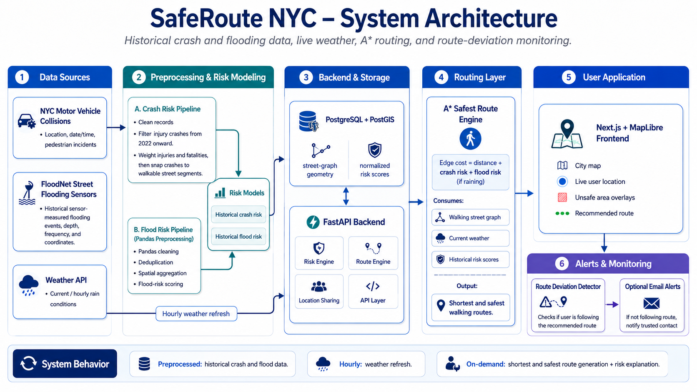

# SafeNYC

**Safest-route navigation for New York City.**

Google Maps gives you the *fastest* route. SafeNYC gives you the *safest* one — routing around streets with a history of injury crashes and around known street-flooding locations when heavy rain is forecast for that borough.

You enter where you are and where you're going. The app draws **two lines**: the shortest path, and the risk-weighted path, with a one-line reason for the difference.

## System architecture



## the heatmap is data-driven

The map's street-segment heatmaps are **not mocked UI styling**. The crash pipeline reads the NYC collisions dataset, weights injury and fatality records, snaps them to the pedestrian street graph, and stores a normalized `crash_risk`; the backend serves those scored segments as GeoJSON from `/risk`, which the UI loads into its MapLibre crash layer (visible by default). FloodNet sensor history is processed the same way into nearby `flood_risk` segments and served from `/flood` for the optional cyan flooding layer. In the currently verified demo data, those endpoints map **6,755 crash-risk segments** and **5,091 flood-risk segments** into the UI.

 Official data sources: NYC Open Data's [Motor Vehicle Collisions - Crashes](https://data.cityofnewyork.us/Public-Safety/Motor-Vehicle-Collisions-Crashes/h9gi-nx95) and [FloodNet: Street Flooding Events Measured by FloodNet Sensors](https://data.cityofnewyork.us/Environment/FloodNet-Street-Flooding-Events/9i7c-xyvv).


---

## Datasets

**None of the raw data is committed** — the crash file alone is 567 MB, well over GitHub's 100 MB per-file limit. Download the files below into `Matias_Section/` before running the notebooks.

### 1. Motor Vehicle Collisions — Crashes

| | |
|---|---|
| **File** | `Motor_Vehicle_Collisions_-_Crashes_20260815.csv` |
| **Size** | 567 MB · 2,269,187 rows × 29 cols |
| **Source** | [NYC Open Data](https://data.cityofnewyork.us/Public-Safety/Motor-Vehicle-Collisions-Crashes/h9gi-nx95) |
| **Covers** | 2012-07-01 → 2026-06-11 |
| **Status** | ✅ Ready to use |

One row per crash. 756,353 people injured, 3,617 killed. Clean `LATITUDE`/`LONGITUDE` on 89% of rows, plus per-category injury and fatality counts.

**Use 2022 onward only** (413,780 rows) — crash volume fell from ~230k/year pre-COVID to ~86k in 2025, so older data describes traffic that no longer exists.

Two traps:
- 7,591 rows sit at exactly `(0, 0)`. Filter by NYC bounding box, not just `NOT NULL`.
- 30% of rows have no `BOROUGH`. Filter by coordinates instead of that column.

### 2. FloodNet — Street Flooding Events

| | |
|---|---|
| **File** | `FloodNet__Street_Flooding_Events_Measured_by_FloodNet_Sensors_20260815.csv` |
| **Size** | 4.8 MB · 2,929 events from 294 sensors |
| **Source** | [NYC Open Data](https://data.cityofnewyork.us/Environment/FloodNet-Street-Flooding-Events/9i7c-xyvv) |
| **Covers** | 2020-11 → 2026-08 |
| **Status** | ⚠️ Needs geocoding before use |

Real sensor measurements of street flooding. Median peak depth 3.5 inches; 1,295 events reached 4 inches or more. Flooding is **accelerating** — 142 events in 2022 versus 1,021 already in 2026.

---

## Repo layout

```
.
├── README.md                    ← you are here
├── RiskMap_Plan.md              full technical plan
├── RiskMap_Plan_v3.pdf          same plan, for sharing
├── .gitignore                   excludes all *.csv and .env
└── Matias_Section/
    ├── *.csv                    the datasets (not committed)
    ├── safenycv1/               Next.js 16 + React 19 + Tailwind 4 frontend
    └── safenycv_backend/        (empty)
```

---

## How risk becomes a route

Every hazard collapses to one number per street segment. No model, no training — a weighted sum tuned by eye.

```
cost = length × (1 + α·crash_risk + β·flood_risk·raining)
```

> **Keep the penalty multiplicative.** Risk only ever pushes cost *upward*, so `cost ≥ length` always holds — which keeps straight-line distance a valid A\* heuristic and the routes correct. If safe streets were ever made *cheaper* than their true length, A\* would return wrong paths and nothing would visibly break.

---

## Stack

| Layer | Choice |
|---|---|
| Frontend | Next.js 16 · React 19 · Tailwind 4 · TypeScript |
| Database | Supabase Postgres + PostGIS |
| Map | Mapbox GL JS (rendering + geocoding) |
| Weather | Open-Meteo — no API key, 5 calls, one per borough |
| Routing | A\* in a Next.js API route |
| Data prep | Python + pandas (notebooks) |

---

## Getting started

```bash
# frontend
cd Matias_Section/safenycv1
npm install
npm run dev            # http://localhost:3000

# data prep
pip install pandas pyarrow matplotlib scipy
```

Create `.env.local` in `safenycv1/` (git-ignored):

```
NEXT_PUBLIC_MAPBOX_TOKEN=...
NEXT_PUBLIC_SUPABASE_URL=...
NEXT_PUBLIC_SUPABASE_ANON_KEY=...
SUPABASE_SERVICE_ROLE_KEY=...
```


